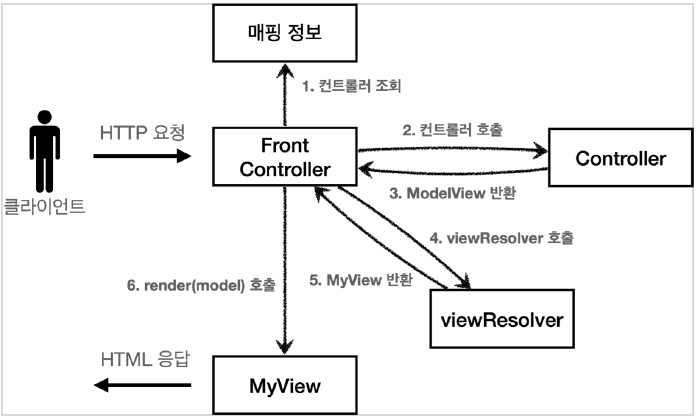

# SpringMVC : 백문이 불여일타

### 김영한의 스프링 완전정복 中 스프링 MVC 1편

강의를 보면서 직접 쳐 본 코드를 커밋한 리포지토리

## 강의를 통해 배운 내용

- Servlet
  - Request, Response
    - HttpServletRequest 객체 기본 사용방법
    - HttpServletResponse 객체 기본 사용방법
    - Http 요청 데이터
      - GET (쿼리파라미터)
      - POST (HTML Form)
      - HTTP API(Json,XML ...)

### 서블릿과 JSP를 사용하여 MVC 구현하기
- MVC2 패턴 : 기존에 사용하던 MVC2 패턴으로 비즈니스 로직 구현
  
    - 포워드가 중복되고, ViewPath를 구현체마다 계속 작성해야해서 비효율적, 또한 response 객체를 사용하지 않음 > 공통로직을 처리하는 객체가 필요하다.  
   
- v1 : 공통로직을 처리하는 FrontController 등장 
  
    - FrontController가 URI-Controller 매핑 등 공통 로직을 처리한 다음 Controller에서 view 페이지로 forward.
    - 필요한 구현체의 비즈니스 로직만 호출하면 되서 일관성을 유지할 수 있음
    - 하지만 Controller에서 view로 이동시키다보니, 코드 중복이있고 깔끔하지가 않음.  
   
- v2 : Controller와 View를 분리

  - Controller는 비즈니스 로직을 수행하고 이동할 URI와 결과데이터(model)를 MyView 객체에 담아서 FrontController에 반환
  - FrontController는 받은 객체의 메서드를 실행하여 응답하는 역할을 수행
  - 각 Controller 객체가 view로 데이터를 전송해야하는 역할을 FrontController가 하므로 본연의 역할에 집중할 수 있음  
   
- v3 : 서블릿의 종속성 제거, view 이름의 중복 제거

 
  - 각 Controller 객체들은 Request 객체와 Response 객체를 받아서 로직을 수행했다.
  - Model과 view를 직접 제작한 객체인 ModelView 객체를 생성하여 서블릿의 종속성을 없앰.
  - Controller는 비즈니스 로직을 수행하고 ModelView 객체를 반환한다. 여기서 view에는 논리이름만 담긴다.
  - ModelView를 받은 FrontController는 viewResolver 객체를 통해 view를 View 객체로 매핑시킨다.(공통로직)
  - View 객체를 응답으로 넘겨준다.  
   
- v4 : 개발자 입장에서 더욱 실용적으로 설계

 
  - 굳이 ModelView 객체를 사용하지 말고, 직접 객체를 넘기도록 설계 
  - FrontController에서 Model 객체를 생성하는 로직을 작성하고, Controller의 로직을 수행하는 process 메서드의 파라미터에 Model과, viewName(논리이름)을 넣음
  - Controller는 곧바로 Model 객체에 데이터 결과물을 담고, 각 객체별로 정해진 논리이름을 넣음
  - **프레임워크나 공통 기능이 수고로워야 사용하는 개발자가 편리해진다!**  
   
- v5 : v3, v4 Controller 어떤것이 와도 호환되도록 설계

  - Controller가 좀 더 확장된 뜻을 가진 Handler로 바뀜
  - 버전이 v3인지 v4인지를 구분해주는 핸들러 어댑터를 추가
  - 핸들러 어댑터가 맞는 버전과 Handler를 확인하고, 해당 Handler에서 비즈니스 로직을 수행하도록 호출
  - 모든 Handler가 같은 객체를 반환해야하므로 ModelView를 반환  
   
    
**지금까지 만들었던 코드는 Spring MVC의 핵심 코드의 축약버전이면서, 구조도 거의 같다.**

    

